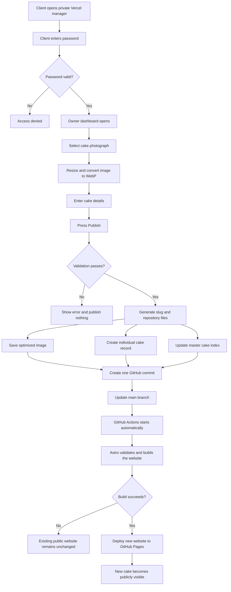
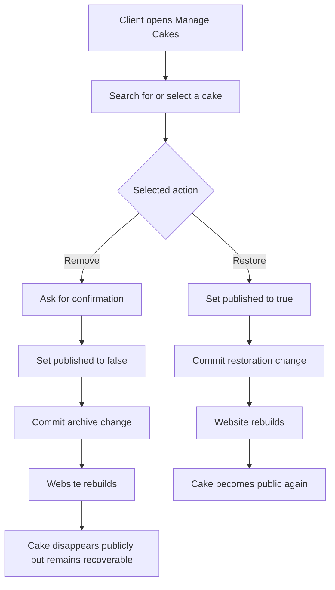
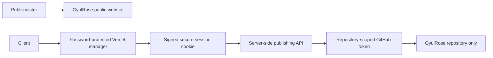

# GyulRose Cake Manager Automation

**Status:** Production complete  
**Owner interface:** <https://gyulrose-cake-manager.vercel.app>  
**Public website:** <https://gyulrosecakes.com>  
**Repository:** `Trendl1ne/GyulRose-Cakes`  
**Last verified:** 14 July 2026

## Purpose

The private Cake Manager allows the GyulRose owner to publish, remove and restore cakes from her phone without receiving access to Gyunay's GitHub account and without requiring routine approval from Gyunay.

The system uses Vercel for the private management application, GitHub as the versioned content store, GitHub Actions for validation and building, and GitHub Pages for the public website.

No n8n workflow, Google account or external database is required for this process.

## System structure

### 1. Private owner interface

The `manager/` directory contains a password-protected Next.js application deployed on Vercel. It provides two workflows:

- Add a new cake.
- Search, remove or restore an existing cake.

Authentication is enforced before the dashboard or its APIs can be accessed.

### 2. Browser-side image preparation

Before upload, the selected photograph is processed in the client's browser:

- Its longest dimension is limited to 1,800 pixels.
- It is converted to WebP.
- It is encoded at approximately 84% quality.
- A preview is shown before publication.

This reduces upload size and keeps the public website performant.

### 3. Validation and publishing API

The Vercel application validates the cake information before writing anything:

- Required fields must be present.
- Text and numeric fields must stay within their permitted ranges.
- The compressed image must stay below the server limit.
- A URL-safe slug is generated from the cake name.
- Duplicate cake slugs are rejected.

For every accepted cake, the application prepares three repository changes:

1. The optimized image in `public/images/cakes/`.
2. The individual content record in `src/content/cakes/`.
3. The updated master index in `src/data/cakes.json`.

All three changes are included in one Git commit, preventing a partial cake record from being intentionally published.

### 4. GitHub content storage

GitHub is the versioned content database. Every addition, removal and restoration creates an identifiable commit on the main branch.

The Vercel application uses a fine-grained GitHub token restricted to the GyulRose repository with only the content permissions required for publishing. The token is stored server-side and is never sent to the client's browser.

### 5. Automatic public deployment

A successful manager commit triggers the existing GitHub Actions website workflow. The workflow installs dependencies, validates the Astro project, builds the static website and deploys it to GitHub Pages.

If the build fails, the previously deployed website remains live. A successful build publishes the new state automatically.

## New cake publishing flow

## Remove and restore flow

Remove is deliberately an archive operation. The photograph and cake details stay in the repository so accidental removals can be reversed from the manager.

## Security model

Security controls include:

- The administrator password is stored as a private Vercel environment variable.
- Successful login creates a signed, HTTP-only, secure, same-site session cookie.
- The session expires after 30 days.
- Invalid logins receive a small fixed delay.
- API routes are unavailable without a valid session.
- The session signing secret and GitHub token remain server-side.
- GitHub access is restricted to the single GyulRose repository.
- Repository updates are non-forced and retain their Git history.
- Passwords, tokens and signing secrets must never be written into this repository.

## Production verification

The complete workflow was tested against production:

1. A temporary test cake was published.
2. Its public page returned HTTP 200.
3. It was removed through the manager.
4. Its public page returned HTTP 404 after deployment.
5. It was restored through the manager.
6. Its public page returned HTTP 200 after deployment.
7. The temporary cake and its files were removed.
8. The retired public uploader was removed and returns HTTP 404.
9. The private manager login returns HTTP 200.
10. The final Astro website and Next.js manager production builds both passed.

## Client operating instructions

### Publish a cake

1. Open the private Cake Manager URL.
2. Sign in using the separately supplied password.
3. Select a cake photograph.
4. Complete the required cake information.
5. Select whether the cake should be featured.
6. Press **Publish cake to website** once.
7. Wait for the website rebuild, which normally completes within approximately two minutes.

### Remove a cake

1. Open **Manage cakes**.
2. Find the cake using search if needed.
3. Press **Remove**.
4. Confirm the action.
5. Wait for the public website to rebuild.

### Restore a cake

1. Open **Manage cakes**.
2. Find the cake marked **Removed**.
3. Press **Restore**.
4. Wait for the public website to rebuild.

## Maintenance notes

- Client feedback after the first real upload should be treated as a future refinement, not unfinished implementation.
- Do not reintroduce a public uploader.
- Do not give the client access to Gyunay's GitHub account.
- Do not replace archive with permanent deletion unless recovery and media-retention requirements are reconsidered.
- If publishing fails, first check the Vercel function logs, the repository-scoped token and the GitHub Actions run.
- If the manager reports success but the website does not change, inspect the latest GitHub Actions deployment before modifying data manually.
- Rotate the manager password, session secret and GitHub token through Vercel environment variables, never through committed files.

## Key implementation files

- `manager/app/manager.tsx`: owner interface, image compression and client actions.
- `manager/app/api/login/route.ts`: password login and session creation.
- `manager/app/api/logout/route.ts`: session termination.
- `manager/app/api/cakes/route.ts`: cake listing and publication endpoint.
- `manager/app/api/cakes/[slug]/route.ts`: archive and restore endpoint.
- `manager/lib/auth.ts`: password comparison and signed-session verification.
- `manager/lib/cake-schema.ts`: cake field validation and slug generation.
- `manager/lib/github.ts`: repository reads, Git object creation and atomic content commits.
- `manager/proxy.ts`: access control for pages and API routes.
- `.github/workflows/deploy-pages.yml`: public website build and deployment.

